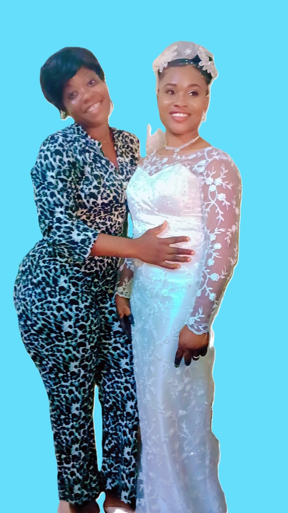
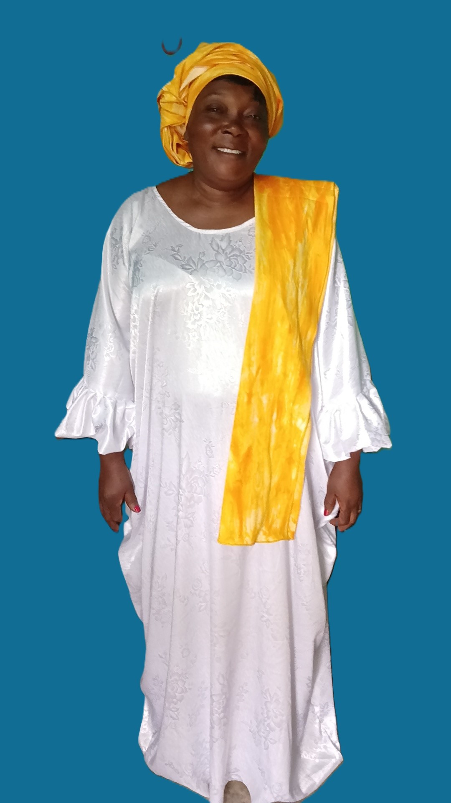
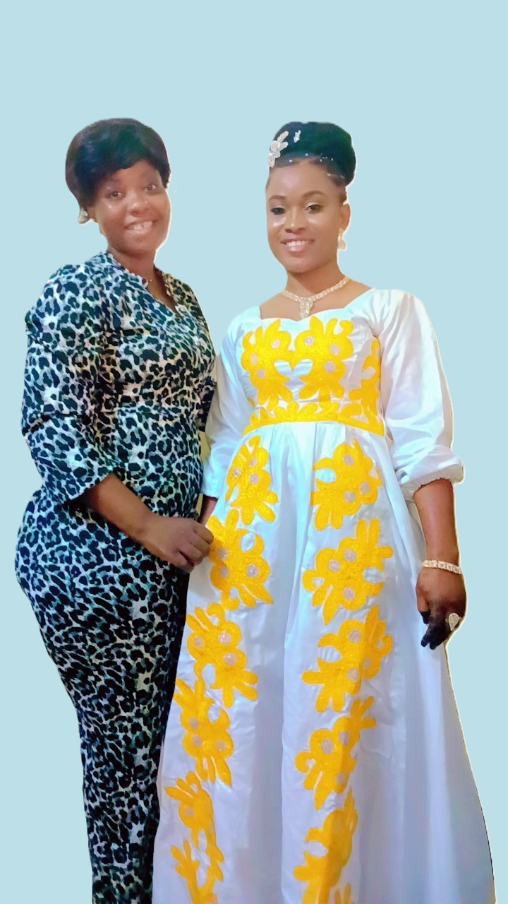
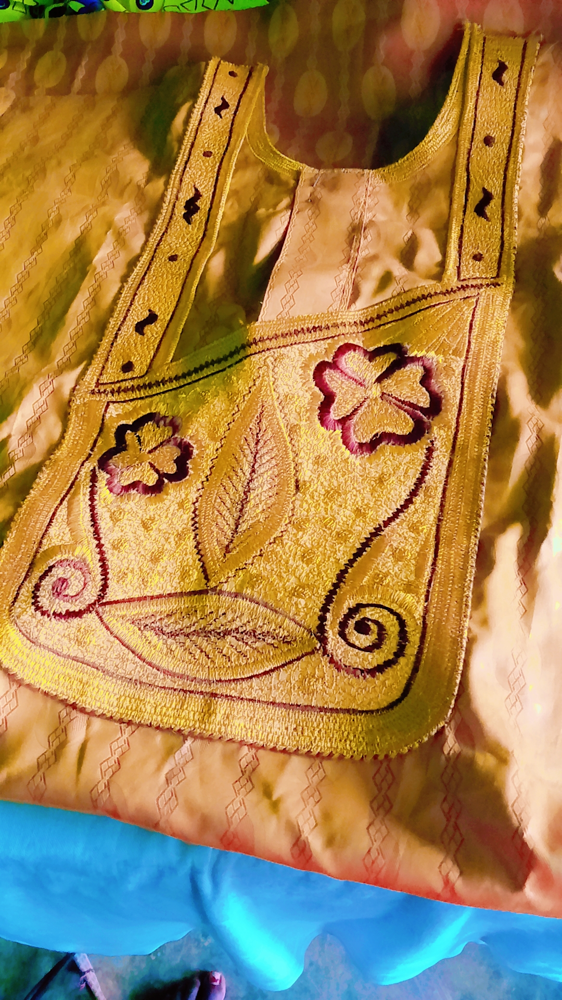

# Assibi's Seamstress Portfolio

Welcome to Assibi Bilabina's Seamstress Portfolio, where passion meets precision in creating custom garments. Explore my journey and the services I offer!

## Table of Contents
1. [About Me](#about-me)
2. [Services](#services)
3. [Portfolio](#portfolio)
4. [Testimonials](#testimonials)
5. [Contact Me](#contact-me)

---

## About Me

Hello! I’m Assibi, a professional seamstress with a passion for crafting custom garments and designs that blend style, comfort, and individuality. With **13 years** of experience in sewing, tailoring, and creative design, I specialize in making dreams come to life through fabric and thread. Whether it’s altering a favorite outfit, creating a bespoke dress, or designing unique home décor, I’m dedicated to delivering quality craftsmanship and exceptional service.

### Skills & Expertise:
- Sewing & Tailoring
- Custom Garment Design
- Embroidery Techniques
- Alterations & Repairs
- Bridal & Formal Wear
- Home Décor Design

I pride myself on delivering tailored solutions that exceed expectations. Every project I take on is personal to me, and I aim to create pieces that truly reflect my clients' unique style and personality.

---

## My Services

Explore the variety of custom services I offer, designed to meet your unique needs and preferences.

1. **Custom Garments**  
   Tailor-made dresses, suits, and outfits for special occasions. Everyday wear designed to fit you perfectly.  
   [Learn More](#custom-garments)

2. **Alterations & Repairs**  
   Adjustments for the perfect fit. Repairs for well-loved garments to give them a new lease on life.  
   [Learn More](#alterations)

3. **Bridal & Formal Wear**  
   Custom wedding dresses and bridesmaid gowns. Tailored suits and evening wear for formal events.  
   [Learn More](#bridal-formal)

4. **Home Décor**  
   Custom curtains, cushions, and other home textiles designed to elevate your living space.  
   [Learn More](#home-decor)

5. **Embroidery**  
   Personalized embroidery designs for clothing, accessories, and gifts.  
   [Learn More](#embroidery)

---

## Portfolio

### Bridal Gown
A custom wedding dress created with intricate lace and beading details.  

### Casual Outfit
Handmade casual wear designed for everyday comfort and style.  

### Altered Dress
Before and after alterations to make the perfect fit for the client.  

### Embroidery
Custom-made embroidery for casual outfits for both men and women.  

---

## Testimonials

Here’s what my clients have to say about my work!

### Client 1 (Bride)
> “I had the most amazing experience working with Assibi. My wedding dress was exactly what I dreamed of—perfectly tailored and unique. The attention to detail was unmatched. Thank you so much for making my big day even more special!”

### Client 2 (Customer)
> “I brought in a dress that didn’t fit quite right, and Assibi made it look like it was made just for me. The service was excellent, and the result exceeded my expectations. I’ll definitely be back for more!”

### Client 3 (Embroidery)
> “The custom curtains Assibi made for my living room are stunning. They completely transformed the space! I couldn't be happier with the final result. Highly recommend for all your tailoring and home décor needs.”

---

## Contact Me

Let’s collaborate! I’d love to hear from you and discuss how I can bring your ideas to life. Please fill out the form below, or reach me via email or phone.

### Contact Form
- **Full Name:**  
  [Enter your full name]
- **Email Address:**  
  [Enter your email]
- **Message:**  
  [Your message...]

[Send Message](#)

---

**Studio Location**  
You can also visit my studio.  
[Google Maps Embed](https://www.google.com/maps/embed?pb=...)

